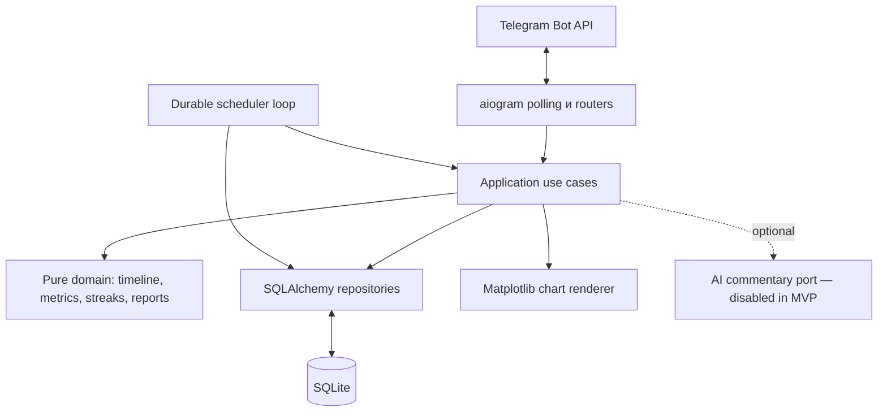

# Архитектура Smoke Runner

Статус: предложено к ревью, версия 1.0  
Основание: продуктовые требования 1.2  
Дата: 2026-08-14

## 1. Архитектурные цели

Система должна:

- запускаться одним процессом на личном VPS;
- разрабатываться без Docker на рабочем ноутбуке;
- обслуживать небольшой круг приглашённых пользователей;
- не терять расписание уведомлений и отчётов после перезапуска;
- хранить все пользовательские данные локально в SQLite;
- сохранять доменные расчёты независимыми от Telegram, базы и будущего AI;
- оставаться достаточно простой, чтобы её мог сопровождать один человек.

Не ставятся цели горизонтального масштабирования, высокой нагрузки, webhook,
публичного API и распределённой обработки.

## 2. Выбранный стек

Точные patch-версии фиксирует `uv.lock`; в `pyproject.toml` задаются совместимые
minor/major-диапазоны.

| Область | Решение | Почему |
|---|---|---|
| Runtime | Python 3.14 | Актуальная стабильная ветка с bugfix-поддержкой до перехода в security mode; проект использует обычный GIL build. |
| Окружение | `uv`, `pyproject.toml`, `uv.lock` | Одинаковое воспроизводимое окружение без Docker и внутри контейнера. |
| Telegram | aiogram 3.x | Asyncio, long polling, routers, middleware, inline keyboard и FSM в одном фреймворке. |
| Доступ к БД | SQLAlchemy 2.1 async + `aiosqlite` | Явные транзакции, типизированные модели и возможность заменить SQLite без переписывания use cases. |
| Миграции | Alembic 1.x | Версионированные forward-миграции схемы SQLAlchemy. |
| Настройки | Pydantic Settings 2.x | Валидация environment variables и secret files при старте. |
| Графики | Matplotlib 3.10+ с backend `Agg` | Генерация PNG без GUI и браузера. |
| Тесты | pytest 9, pytest-asyncio, Hypothesis | Табличные, асинхронные и генеративные проверки временной логики. |
| Качество | Ruff + mypy | Быстрый lint/format и статическая проверка границ слоёв. |

Python 3.14 находится в bugfix-статусе и поддерживается до 2030 года согласно
[официальной таблице версий Python](https://devguide.python.org/versions/).
aiogram документирует asyncio, routers, FSM и long polling в
[официальной документации](https://docs.aiogram.dev/en/v3.29.0/).
SQLAlchemy поддерживает `sqlite+aiosqlite` через async engine, при этом требует
отдельный `AsyncSession` на задачу
([SQLite dialect](https://docs.sqlalchemy.org/en/21/dialects/sqlite.html),
[session concurrency](https://docs.sqlalchemy.org/en/20/orm/session_basics.html)).

### Что намеренно не добавляется

- Redis;
- APScheduler или Celery;
- FastAPI/HTTP-сервер;
- отдельный worker;
- отдельное хранилище аналитики;
- LLM SDK в MVP;
- ORM-объекты внутри доменного слоя.

## 3. Общая схема



Это модульный монолит: один deployable-процесс, но зависимости между слоями
направлены внутрь. Telegram и SQLite являются адаптерами, а не местом хранения
бизнес-правил.

## 4. Структура исходников

```text
src/smoke_runner/
  __main__.py
  bootstrap.py
  config.py

  domain/
    models.py
    timeline.py
    interval_policy.py
    metrics.py
    streaks.py
    report_models.py
    feedback.py
    clock.py

  application/
    ports.py
    auth.py
    sessions.py
    wakes.py
    intervals.py
    history.py
    dashboard.py
    notifications.py
    reports.py
    admin.py

  infrastructure/
    db/
      models.py
      engine.py
      repositories.py
    telegram/
      middlewares.py
      routers/
      keyboards.py
      renderers.py
      fsm.py
    scheduler.py
    charts.py
    ai_commentary.py
    logging.py
    backup.py

alembic/
tests/
  unit/
  integration/
  acceptance/
```

Правило зависимости:

```text
telegram/infrastructure -> application -> domain
db/infrastructure ------> application ports
domain -----------------> только Python standard library
```

## 5. Модель исполнения

В одном asyncio event loop работают:

1. aiogram long-polling;
2. один durable scheduler loop;
3. короткие обработчики Telegram updates;
4. фоновые построения графиков через `asyncio.to_thread`.

Одновременно запускается только один экземпляр приложения. Long polling через
`getUpdates` поддерживается Telegram Bot API, а редактирование одного экрана
строится на `editMessageText` и inline keyboard
([Telegram Bot API](https://core.telegram.org/bots/api)).

### Ограничение конкурентности

Polling не должен создавать неограниченное число handler tasks. На старте
задаётся конечный `tasks_concurrency_limit` aiogram. Для каждого use case
создаётся собственный `AsyncSession`; сессия никогда не передаётся в другую
asyncio-задачу.

## 6. Основные потоки

### 6.1. «Покурил сейчас»

1. Middleware проверяет private chat и активного пользователя.
2. В одной DB-транзакции:
   - фиксируется `processed_update`;
   - создаётся smoking session;
   - загружается и пересчитывается timeline пользователя;
   - прежнее pending milestone-уведомление помечается `superseded`;
   - сохраняется новый целевой рубеж и pending-уведомление.
3. Транзакция завершается.
4. Бот редактирует текущий экран и отправляет шаблонную поддержку.
5. Scheduler wake event будит фоновый цикл, если новый рубеж раньше текущего сна.

Повтор того же Telegram update останавливается на уникальном `update_id` и не
создаёт вторую сессию.

### 6.2. Сессия задним числом или исправление

1. FSM собирает дату/время и просит подтверждение.
2. Use case сохраняет изменение.
3. Timeline пересчитывается от самой ранней затронутой точки, включая сетку
   рубежей, нарушения, серии и актуальное milestone-уведомление.
4. Уже отправленные старые отчёты не редактируются; ручной повтор строится по
   новой истории.

Производные признаки не записываются в smoking session. Источником истины остаются
события и история интервалов.

### 6.3. Экран в Telegram

У пользователя хранится один `message_id` основного экрана. Dashboard, история,
настройки и детали записи редактируют это сообщение вместо отправки длинной
цепочки.

- `screen_kind=dashboard` разрешает пятиминутное автообновление.
- При переходе в историю автообновление приостанавливается и не затирает экран.
- Кнопка «На главный экран» возвращает dashboard и открывает новое 30-минутное
  активное окно.
- Уведомление о рубеже является отдельным сообщением; оно не заменяет историю.

FSM для незавершённого ввода хранится в памяти. После рестарта пользователь может
потерять только незаконченную форму, но не подтверждённые данные. Redis ради
этого сценария не добавляется.

### 6.4. Отчёт

1. Scheduler создаёт/claim-ит delivery для конкретного пользователя и периода.
2. Репозиторий загружает события, необходимые для периода и граничных интервалов.
3. DB-транзакция закрывается.
4. Pure domain строит `ReportSnapshot`.
5. Matplotlib в worker thread создаёт два PNG в `BytesIO`.
6. Необязательный AI port возвращает `None` в MVP.
7. Snapshot сохраняется в delivery, чтобы retry не пересчитал уже начатый отчёт.
8. Telegram adapter по порядку отправляет delivery parts: текст и изображения.
9. Каждая часть отдельно сохраняет Telegram message id; recovery продолжает с
   первой незафиксированной части.

Числа никогда не рассчитываются в Telegram renderer или AI-комментаторе.

## 7. Durable scheduler без внешнего планировщика

Расписание является частью предметной области и хранится в SQLite. Отдельная
библиотека jobs создаст второе состояние, которое пришлось бы синхронизировать с
сессиями и правками задним числом.

Scheduler loop:

1. находит ближайшее `target_at`, report boundary или `next_refresh_at`;
2. спит до него, но не дольше 30 секунд;
3. может быть немедленно разбужен через `asyncio.Event` после handler commit;
4. атомарно claim-ит due item условным `UPDATE`;
5. вызывает application use case;
6. сохраняет результат и вычисляет следующий wake-up.

После запуска scheduler сначала выполняет recovery:

- догоняет milestone не старше 15 минут;
- старые milestone помечает `skipped_stale`;
- создаёт отсутствующие ежедневные/недельные deliveries;
- не возобновляет истёкшие активные dashboard-окна;
- сбрасывает только безопасно повторяемые claims.

Локальные границы отчётов вычисляются через `zoneinfo.ZoneInfo`, затем переводятся
в UTC. Daily period: предыдущий локальный день. Weekly period: воскресенье 00:00
— следующее воскресенье 00:00, отправка в 09:00.

Ручной ввод локального времени также проходит через `ZoneInfo`. Для неоднозначного
часа при осеннем переводе бот просит выбрать первый или второй вариант; несущее
время при весеннем переводе отклоняется с понятным сообщением. В базе остаётся
только однозначный UTC timestamp.

## 8. SQLite и транзакции

Для ожидаемой нагрузки SQLite достаточно. Конфигурация MVP:

- один application process;
- один connection pool slot (`pool_size=1`, `max_overflow=0`);
- `PRAGMA foreign_keys=ON`;
- `PRAGMA busy_timeout=5000`;
- короткие транзакции;
- journal mode `DELETE`, `synchronous=FULL`;
- графики и Telegram calls выполняются вне транзакций.

WAL намеренно не включается в первой версии: выигрыш для маленького single-writer
бота невелик, а эксплуатация и резервное копирование усложняются. Официальная
документация SQLite также описывает WAL как дополнительное состояние из `-wal`
и `-shm` файлов и требует учитывать checkpointing
([SQLite WAL](https://www.sqlite.org/wal.html)).

Если число пользователей или конкурирующих записей заметно вырастет, следующая
ступень — PostgreSQL, а не усложнение SQLite множеством процессов.

## 9. Авторизация и безопасность

### Начальный администратор

`ADMIN_TELEGRAM_USER_ID` задаётся обязательной настройкой. На bootstrap
соответствующий пользователь создаётся или получает роль `admin`. Bot token и
invite-code pepper поступают только через environment/secret file.

### Приглашение

- Генерируется минимум 128 бит случайности через `secrets`.
- Пользователю передаётся `/start <code>` или код для ручного ввода.
- В базе хранится только HMAC-SHA256 digest с server-side pepper.
- Код одноразовый, имеет срок действия и погашается атомарно.
- После активации авторизация всегда идёт по Telegram user ID.

### Изоляция

- Middleware передаёт внутренний `user_id`, найденный по отправителю.
- Все repository methods для пользовательских данных требуют `user_id`.
- Callback payload может содержать record id, но владелец повторно проверяется в
  SQL `WHERE id=:id AND user_id=:user_id`.
- Product handlers работают только в private chat.
- Отзыв доступа проверяется на каждом update и перед каждой фоновой отправкой.

## 10. Семантика отправки

Telegram Bot API не предоставляет приложению общей exactly-once транзакции с
SQLite. Поэтому MVP гарантирует дедупликацию внутри приложения, но документирует
редкое crash-окно между Telegram API и фиксацией результата.

- Milestone-поздравления имеют приоритет «не дублировать»: claim сохраняется до
  вызова Telegram; неизвестный результат после crash автоматически не повторяется.
- Отчёты имеют приоритет «доставить»: текст и каждое изображение учитываются как
  отдельные delivery parts. Recovery не повторяет уже подтверждённые части, но
  неизвестный результат одной части может быть повторён один раз, поэтому в
  крайне редком crash-окне возможен её дубль.
- Редактирование dashboard безопасно повторять по сохранённому `message_id`.
- Ручная команда администратора позволяет повторно отправить конкретный отчёт.

Это ограничение должно быть видно в runbook и интеграционных тестах с имитацией
сбоев на каждой границе.

## 11. Будущий AI-комментатор

Application port:

```python
class ReportCommentator(Protocol):
    async def comment(self, summary: ReportCommentaryInput) -> str | None: ...
```

В MVP используется `DisabledReportCommentator`, всегда возвращающий `None`.
`ReportCommentaryInput` содержит только уже рассчитанные метрики, сравнения и
детерминированно найденные факты. Telegram identifiers, invite codes и raw DB
rows в контракт не входят.

Будущая реализация добавит opt-in, timeout, ограничение длины, prompt version и
provider metadata без изменений доменного расчёта или Telegram handlers.

## 12. Конфигурация

Обязательные настройки:

```text
SMOKE_RUNNER_BOT_TOKEN
SMOKE_RUNNER_ADMIN_TELEGRAM_USER_ID
SMOKE_RUNNER_INVITE_PEPPER
SMOKE_RUNNER_DATABASE_PATH
```

Опциональные настройки имеют безопасные defaults:

```text
SMOKE_RUNNER_LOG_LEVEL=INFO
SMOKE_RUNNER_DEFAULT_TIMEZONE=Europe/Moscow
SMOKE_RUNNER_BACKUP_DIR=/data/backups
SMOKE_RUNNER_BACKUP_RETENTION_DAYS=30
```

`.env` разрешён только для локальной разработки и находится в `.gitignore`.
Production читает environment variables или mounted secret files. Pydantic
Settings валидирует наличие и формат при старте
([официальная документация](https://docs.pydantic.dev/latest/concepts/pydantic_settings/)).

## 13. Разработка и развёртывание

### Рабочий ноутбук без Docker

```text
uv sync
uv run alembic upgrade head
uv run python -m smoke_runner
uv run pytest
```

`uv.lock` коммитится и обеспечивает одинаковые зависимости. `uv sync` создаёт
обычный `.venv`, поэтому редактор и debugger работают без контейнера
([uv projects](https://docs.astral.sh/uv/guides/projects/)).

### VPS

Основной production-путь — Docker image:

- multi-stage build;
- непривилегированный пользователь;
- read-only application filesystem;
- writable `/data` volume для SQLite и backups;
- writable tmpfs `/tmp`; `MPLBACKEND=Agg` и `MPLCONFIGDIR=/tmp/matplotlib`;
- один replica;
- graceful SIGTERM;
- restart policy;
- никакого опубликованного TCP-порта.

Запасной путь — тот же `uv.lock` и virtual environment под `systemd`. Код и
расположение `/data` от способа запуска не зависят.

## 14. Backup и восстановление

Ежедневный backup выполняется SQLite Online Backup API в отдельном thread в
малонагруженное время. Простое копирование открытого файла не используется.
SQLite документирует backup API как способ создать согласованный snapshot живой базы
([SQLite Backup API](https://www.sqlite.org/backup.html)).

- backup именуется UTC timestamp;
- хранится 30 дней по умолчанию;
- каталог `/data`, файл БД и backups доступны только Unix-пользователю процесса;
- после создания выполняются `PRAGMA integrity_check` и пробное открытие;
- restore runbook останавливает приложение, сохраняет повреждённый файл отдельно,
  восстанавливает snapshot и запускает миграции;
- минимум раз перед пилотом выполняется настоящий restore drill.

## 15. Наблюдаемость

- Structured JSON logs в stdout.
- Correlation fields: `update_id`, внутренний `user_id`, use case, delivery id.
- Никаких bot token, invite code, username и текстов будущего AI в INFO logs.
- Scheduler обновляет heartbeat в `runtime_state`.
- Команда `python -m smoke_runner healthcheck` проверяет доступность БД, свежесть
  heartbeat и актуальность миграций.
- Ошибки Telegram, БД и генерации графиков классифицируются и логируются отдельно.

## 16. Границы масштабирования

Архитектура рассчитана на десятки, а не тысячи активных пользователей. Сигналы к
пересмотру:

- handler регулярно ждёт SQLite write lock;
- отчёты не укладываются в окно доставки;
- один scheduler loop систематически отстаёт;
- нужен второй replica для доступности;
- история одного пользователя становится слишком большой для O(N) пересчёта.

Тогда сохраняются domain/application слои, а SQLite repositories заменяются на
PostgreSQL, scheduler — на transactional outbox/worker. До появления этих
сигналов такая инфраструктура является преждевременной.
