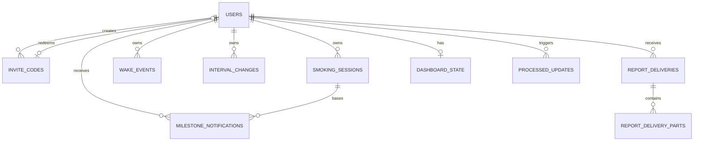

# Модель данных SQLite

Статус: согласовано, версия 1.0
Связанный документ: [Архитектура](architecture.md)

## 1. Соглашения

- Все первичные ключи — SQLite `INTEGER PRIMARY KEY`.
- Все абсолютные моменты — UTC Unix seconds в `INTEGER` с суффиксом `_at_utc`.
- Длительности — целые секунды.
- Boolean — `INTEGER NOT NULL CHECK (value IN (0, 1))`.
- Enum — `TEXT` с `CHECK` constraint.
- Пользовательские записи удаляются мягко через `deleted_at_utc`.
- Таблицы не хранят вычисленные нарушения, серии и отчётные агрегаты.
- Все foreign keys включены и индексированы.
- Временная зона хранится IANA-именем, например `Europe/Moscow`.

## 2. Связи



## 3. Таблицы

### `users`

| Колонка | Тип | Правило |
|---|---|---|
| `id` | INTEGER PK | Внутренний идентификатор. |
| `telegram_user_id` | INTEGER | `UNIQUE NOT NULL`. Не username. |
| `telegram_private_chat_id` | INTEGER | `UNIQUE NOT NULL`. |
| `role` | TEXT | `admin` или `member`. |
| `status` | TEXT | `active` или `revoked`. |
| `timezone_name` | TEXT | Default `Europe/Moscow`. |
| `milestone_notifications_enabled` | INTEGER | Default 1. |
| `ai_commentary_enabled` | INTEGER | Default 0; в MVP изменить на 1 нельзя. |
| `last_feedback_template_key` | TEXT NULL | Защита от повтора одной похвалы. |
| `activated_at_utc` | INTEGER | Начало серий и первой неполной недели. |
| `revoked_at_utc` | INTEGER NULL | Момент отзыва. |
| `created_at_utc` | INTEGER | Audit. |
| `updated_at_utc` | INTEGER | Audit. |

Администратор не отделён в специальную таблицу: role достаточно для маленького
приложения. Последнего активного администратора нельзя отозвать.

### `invite_codes`

| Колонка | Тип | Правило |
|---|---|---|
| `id` | INTEGER PK | — |
| `code_digest` | TEXT | `UNIQUE NOT NULL`, HMAC-SHA256 hex. |
| `created_by_user_id` | FK users | Только admin. |
| `created_at_utc` | INTEGER | — |
| `expires_at_utc` | INTEGER | Обязательно. |
| `redeemed_at_utc` | INTEGER NULL | Однократность. |
| `redeemed_by_user_id` | FK users NULL | Созданный пользователь. |
| `revoked_at_utc` | INTEGER NULL | Ручная отмена. |

Погашение выполняется условным `UPDATE`, проверяющим expiry, `redeemed_at IS NULL`
и `revoked_at IS NULL` в той же транзакции, где создаётся user.

### `smoking_sessions`

| Колонка | Тип | Правило |
|---|---|---|
| `id` | INTEGER PK | — |
| `user_id` | FK users | `NOT NULL`. |
| `occurred_at_utc` | INTEGER | Фактическое время. |
| `source` | TEXT | `now` или `backfill`. |
| `created_from_update_id` | INTEGER NULL | Для трассировки/idempotency. |
| `created_at_utc` | INTEGER | Время записи. |
| `updated_at_utc` | INTEGER | Последняя правка. |
| `deleted_at_utc` | INTEGER NULL | Soft delete/undo. |

Точный дубль разрешён: продукт сознательно не объединяет близкие сессии.
Сортировка timeline: `occurred_at_utc`, затем `id`.

### `wake_events`

Колонки совпадают со `smoking_sessions`. Ограничение «одно основное пробуждение
на локальную дату» проверяется application service, потому что локальная дата
зависит от IANA timezone и не выражается надёжным SQLite constraint.

Повторная запись после подтверждения мягко удаляет старую и создаёт/обновляет
новую в одной транзакции.

### `interval_changes`

| Колонка | Тип | Правило |
|---|---|---|
| `id` | INTEGER PK | — |
| `user_id` | FK users | — |
| `effective_at_utc` | INTEGER | Изменение только «сейчас». |
| `interval_seconds` | INTEGER | Нормализованная длительность. |
| `display_unit` | TEXT | `hour` или `day`. |
| `created_from_update_id` | INTEGER NULL | — |
| `created_at_utc` | INTEGER | — |

Constraint для `interval_seconds`:

```text
(3600 <= value <= 86400 AND value % 3600 = 0)
OR
(86400 <= value <= 604800 AND value % 86400 = 0)
```

`display_unit` сохраняет выбор пользователя для `24 часа` против `1 дня`, но
расчёты используют только seconds. При активации создаётся первая запись `1 час`.

### `processed_updates`

| Колонка | Тип | Правило |
|---|---|---|
| `telegram_update_id` | INTEGER PK | Глобальный idempotency key Telegram. |
| `user_id` | FK users NULL | NULL для неавторизованного update. |
| `outcome` | TEXT | `processed`, `ignored`, `rejected`. |
| `processed_at_utc` | INTEGER | — |

Запись update и вызванное им изменение предметных таблиц коммитятся одной
транзакцией.

### `milestone_notifications`

| Колонка | Тип | Правило |
|---|---|---|
| `id` | INTEGER PK | — |
| `user_id` | FK users | — |
| `basis_session_id` | FK smoking_sessions | Сессия, после которой рассчитан рубеж. |
| `target_at_utc` | INTEGER | Вычисленный `Tᵢ₊₁`. |
| `status` | TEXT | `pending`, `claimed`, `sent`, `superseded`, `skipped_stale`, `failed_unknown`. |
| `claimed_at_utc` | INTEGER NULL | At-most-once claim. |
| `sent_at_utc` | INTEGER NULL | — |
| `telegram_message_id` | INTEGER NULL | Результат Telegram. |
| `error_code` | TEXT NULL | Без текста/секретов. |
| `created_at_utc` | INTEGER | — |
| `updated_at_utc` | INTEGER | — |

В транзакции пересчёта все `pending` текущего пользователя становятся
`superseded`, затем создаётся одна новая строка, если уведомления включены и
рубеж находится в будущем.

### `report_deliveries`

| Колонка | Тип | Правило |
|---|---|---|
| `id` | INTEGER PK | — |
| `user_id` | FK users | — |
| `report_type` | TEXT | `daily` или `weekly`. |
| `period_start_utc` | INTEGER | Inclusive. |
| `period_end_utc` | INTEGER | Exclusive. |
| `is_partial` | INTEGER | Первая неполная неделя. |
| `status` | TEXT | `pending`, `claimed`, `sent`, `failed`, `failed_unknown`. |
| `attempt_count` | INTEGER | Ограниченный retry. |
| `claimed_at_utc` | INTEGER NULL | — |
| `generated_at_utc` | INTEGER NULL | — |
| `snapshot_json` | TEXT NULL | Версионированный typed snapshot для стабильного retry. |
| `sent_at_utc` | INTEGER NULL | — |
| `error_code` | TEXT NULL | — |
| `created_at_utc` | INTEGER | — |
| `updated_at_utc` | INTEGER | — |

Unique constraint:

```text
UNIQUE(user_id, report_type, period_start_utc, period_end_utc)
```

### `report_delivery_parts`

| Колонка | Тип | Правило |
|---|---|---|
| `id` | INTEGER PK | — |
| `report_delivery_id` | FK report_deliveries | `ON DELETE CASCADE`. |
| `ordinal` | INTEGER | Порядок отправки. |
| `part_type` | TEXT | `text`, `current_week_chart`, `history_chart`. |
| `status` | TEXT | `pending`, `claimed`, `sent`, `failed_unknown`. |
| `attempt_count` | INTEGER | Bounded retry. |
| `claimed_at_utc` | INTEGER NULL | — |
| `sent_at_utc` | INTEGER NULL | — |
| `telegram_message_id` | INTEGER NULL | — |
| `error_code` | TEXT NULL | — |

`UNIQUE(report_delivery_id, ordinal)` сохраняет порядок. PNG не хранится в базе:
он детерминированно перестраивается из `snapshot_json`. Recovery пропускает parts
со статусом `sent` и продолжает с первой незавершённой.

### `dashboard_state`

| Колонка | Тип | Правило |
|---|---|---|
| `user_id` | PK/FK users | Одна строка на пользователя. |
| `telegram_chat_id` | INTEGER | Private chat. |
| `telegram_message_id` | INTEGER NULL | Создаётся при первом экране. |
| `screen_kind` | TEXT | `dashboard`, `history`, `record`, `settings`, `report`. |
| `active_until_utc` | INTEGER NULL | Только dashboard. |
| `next_refresh_at_utc` | INTEGER NULL | Пятиминутный tick. |
| `updated_at_utc` | INTEGER | — |

### `runtime_state`

Key/value таблица для эксплуатационного состояния, не пользовательских данных:

- `scheduler_heartbeat_at_utc`;
- `last_successful_backup_at_utc`;
- `application_started_at_utc`.

## 4. Индексы

Минимальный набор:

```text
smoking_sessions(user_id, occurred_at_utc, id) WHERE deleted_at_utc IS NULL
wake_events(user_id, occurred_at_utc, id) WHERE deleted_at_utc IS NULL
interval_changes(user_id, effective_at_utc, id)
milestone_notifications(status, target_at_utc)
report_deliveries(status, period_end_utc)
report_delivery_parts(report_delivery_id, ordinal)
invite_codes(code_digest)
```

Индексы добавляются только под подтверждённые queries и проверяются через
`EXPLAIN QUERY PLAN` в integration tests.

## 5. Timeline и производные данные

Для одного пользователя загружаются активные sessions и interval changes.
События сортируются хронологически. Interval change с тем же timestamp действует
до smoking session с этим timestamp.

Pure function возвращает для каждой smoking session:

- действующий interval;
- текущий target;
- earliness/lateness;
- reaction class;
- следующий target по кусочному правилу требований 1.2.

O(N)-пересчёт всей истории допустим для ожидаемых тысяч записей на пользователя.
Кэш и materialized metrics не вводятся до измеренной необходимости.

Изменение интервала сбрасывает текущую сетку: новый target равен последней
фактической session плюс новый interval. Если sessions ещё нет, target отсутствует.

## 6. Запросы отчётов

Daily/weekly report service получает:

- все sessions внутри периода;
- предыдущую session до начала периода для пограничного actual gap;
- wake events, пересекающие нужные wake cycles;
- interval changes до конца периода;
- activation timestamp и timezone.

Для простоты первая реализация может загрузить всю историю одного пользователя и
построить timeline в памяти. Оптимизированные диапазонные queries добавляются
только после профилирования и должны давать идентичный `ReportSnapshot`.

## 7. Миграции

- Alembic revision создаётся для каждого изменения схемы.
- Production запускает `alembic upgrade head` отдельным entrypoint-шагом до bot.
- Автогенерация является черновиком: constraints, partial indexes и downgrade
  проверяются вручную.
- Миграция никогда молча не удаляет пользовательские данные.
- Перед потенциально опасной миграцией создаётся и проверяется backup.
